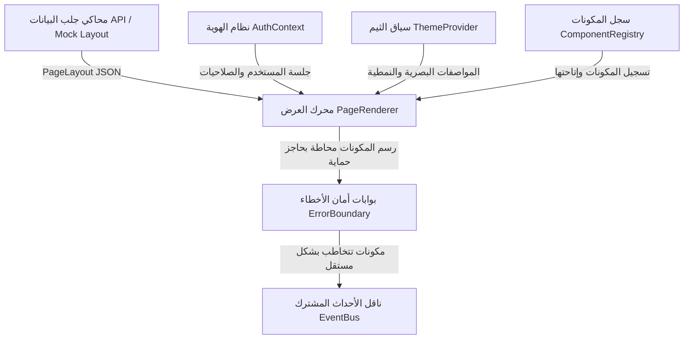

# LITC-TS v43.0 - نظام حوكمة التذاكر والواجهات الديناميكية السيادي

مرحباً بك في وثيقة التصميم والمعمارية الأساسية للجيل الجديد من نظام **LITC-TS v43.0**. تم بناء هذه النسخة المتقدمة والمعزولة بالكامل لتلبية معايير الأمان السيادي، وديناميكية الواجهات القصوى، وحسابات الـ SLA الدقيقة.

---

## 1. نظرة عامة على معمارية النظام (System Architecture Overview)

يعتمد التطبيق على معمارية **Metadata-Driven Dynamic UI** (الواجهات الموجهة بالمعطيات)، حيث يتم الفصل التام بين منطق جلب وتخطيط الصفحات وبين طريقة عرضها الفعلي.



### المكونات الجوهرية:
* **سجل المكونات (`ComponentRegistry`):** السجل المركزي الفهرسي لتسجيل المكونات البرمجية (`Map`) وربط مسمياتها الديناميكية بالفئات الحقيقية لها، مما يتيح استدعاءها لحظياً بالاسم.
* **محرك العرض (`PageRenderer`):** القلب النابض للواجهة؛ يستلم مصفوفة توصيف المكونات (`PageLayout`) ويتحقق أمنياً من الصلاحيات ثم يقوم برسم المكونات بشكل متسلسل في شجرة React.
* **ناقل الأحداث المشترك (`EventBus`):** يطبق نمط Pub/Sub للسماح للمكونات بالتخاطب وبث الإشارات واستقبالها بشكل غير مباشر وتفادي الاقتران الشديد (Loose Coupling).

---

## 2. بروتوكول إضافة مكون جديد (Adding a New Component Protocol)

لإضافة مكون جديد إلى النظام بأمان تام، يرجى اتباع الخطوات الأربع التالية:

### الخطوة 1: تعريف نوع المكون في الأنواع
افتح ملف [component.types.ts](file:///c:/Users/majdi.alzarrouk/OneDrive%20-%20LITC/Desktop/المشاريع/v43_Production/src/types/component.types.ts) وأضف اسم المكون إلى تعريف الـ `ComponentType`:
```typescript
export type ComponentType = 'TicketList' | 'ActionButton' | 'AssetMonitor' | 'StatsWidget' | 'NewComponent';
```

### الخطوة 2: إنشاء المكون وربطه بالثيم المركزي
أنشئ ملف المكون البرمجي (مثلاً `src/components/atoms/NewComponent.tsx`). استهلك الثيم ديناميكياً باستخدام `useTheme` لتطبيق الألوان والخطوط والهوامش:
```typescript
import React from 'react';
import { useTheme } from '../../engine/ui-loader/ThemeProvider';

export const NewComponent: React.FC = () => {
  const theme = useTheme();
  return (
    <div style={{ padding: theme.spacing.md, backgroundColor: theme.colors.surface }}>
      <p style={{ color: theme.colors.text, fontSize: theme.typography.fontSize }}>
        مكون جديد محمي ومتصل بنظام الثيمات!
      </p>
    </div>
  );
};
```

### الخطوة 3: تسجيل المكون في الـ ComponentRegistry
افتح ملف [ComponentRegistry.ts](file:///c:/Users/majdi.alzarrouk/OneDrive%20-%20LITC/Desktop/المشاريع/v43_Production/src/engine/ui-loader/ComponentRegistry.ts) وقم باستيراد المكون وتسجيله أمنياً:
```typescript
import { NewComponent } from '../../components/atoms/NewComponent';

// ضمن قائمة تسجيل المكونات
registry.set('NewComponent', NewComponent);
```

### الخطوة 4: حوكمة وإدارة الصلاحيات
في قاعدة البيانات أو ملفات الـ Mock (مثل [mock.layout.ts](file:///c:/Users/majdi.alzarrouk/OneDrive%20-%20LITC/Desktop/المشاريع/v43_Production/src/data/mock.layout.ts))، عند استدعاء المكون، حدد الصلاحيات الأمنية المطلوبة لعرضه في حقل `permissions`:
```typescript
{
  id: 'new-comp-001',
  type: 'NewComponent',
  permissions: ['admin', 'view_new_comp'],
  policy: 'global',
  props: {}
}
```

---

## 3. ميثاق الاستقرار والأمن الفائق (The Stability Promise)

يلتزم نظام **LITC-TS v43.0** بأقصى معايير الاستقرار وتجنب الانهيارات من خلال طبقتين أساسيتين:

1. **بوابة الأمان وحقن الهوية (`AuthContext`):**
   * تمنع بصفة قطعية رسم أي صفحة أو نموذج في حال غياب جلسة مستخدم نشطة.
   * تحجب المكونات الحساسة تلقائياً على مستوى الفرونت إند بفلترة الصلاحيات ديناميكياً قبل تمرير المكون لـ React، مما يمنع محاولات استغلال الواجهات برمجياً.
2. **بوابات عزل وحصار الأخطاء (`ErrorBoundary`):**
   * يغلف كل مكون ديناميكي بشكل منفصل.
   * في حال حدوث خطأ برمجي غير متوقع في مكون فردي (مثل فشل قراءة خاصية، أو تدهور اتصال شبكي فرعي)، يلتقط الـ `ErrorBoundary` الاستثناء ويعرض واجهة بديلة بسيطة للمكون المعطل، مما يضمن استمرارية باقي المكونات الحيوية على الشاشة واستمرار النظام في العمل دون توقف.

---

## 4. دليل تخصيص وتعديل الثيمات (Theme Customization Guide)

يمكن تغيير الهوية البصرية للنظام بالكامل (Rebranding) لحظياً دون الحاجة لتعديل أو لمس أي كود برمجي في المكونات، وذلك من خلال تعديل ملف الثيمات المركزي الموحد:

🔗 **رابط الملف المصدر:** [theme.ts](file:///c:/Users/majdi.alzarrouk/OneDrive%20-%20LITC/Desktop/المشاريع/v43_Production/src/styles/theme.ts)

### التغيير الفوري:
يمكنك استبدال كود اللون الأساسي، الخلفيات، الهوامش، والخطوط من مكان واحد كالتالي:
```typescript
export const theme: Theme = {
  colors: {
    primary: '#ff0055',    // تغيير لون النظام الرئيسي بالكامل
    secondary: '#fff0f5',  // تغيير اللون الثانوي
    background: '#121212', // تفعيل الوضع المظلم (Dark Mode)
    ...
  },
  spacing: {
    md: '20px', // تعديل الهوامش الموحدة في الواجهات
    ...
  }
};
```
بمجرد الحفظ، ستقوم React بتحديث المظهر العام فاعلياً لجميع الأزرار والمصغرات المتصلة بـ `ThemeProvider` في نفس اللحظة.
